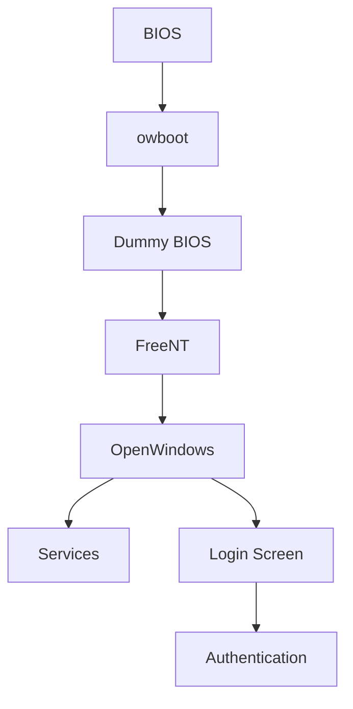

# owboot

The bootloader used by the OpenWindows operating system.

## How does it work?

```mermaid
graph TD;
    BIOS-->owboot;
    owboot-->C[Dummy BIOS];
    C-->FreeNT;
    FreeNT-->OpenWindows;
    OpenWindows-->Services;
    OpenWindows-->L[Login Screen];
    L-->Authentication;
```
