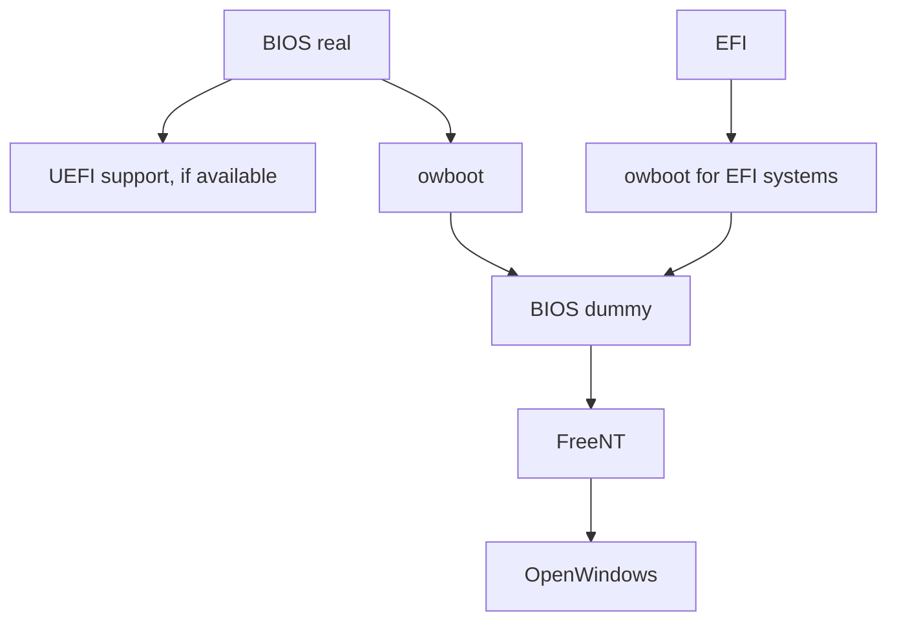

# owboot

The bootloader used by the OpenWindows operating system.

## How does it work?

First, the BIOS loads up, and executes the owboot binary (or EFI file).
Then, owboot thinks there is **no BIOS** and creates a virtual one.
It then inserts the selected boot image into memory, and boots
the virtual BIOS.

After a reboot or power off, the virtual BIOS disappears, and the next time the system
powers up, a new one is created.

> **Note**: owboot will not create a virtual BIOS when using the `firmtools`
> command, as the firmware settings are not available from owboot's
> virtual system.
